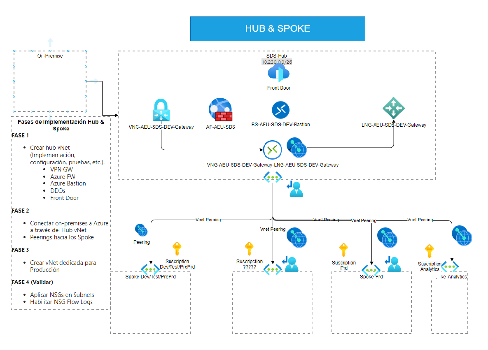
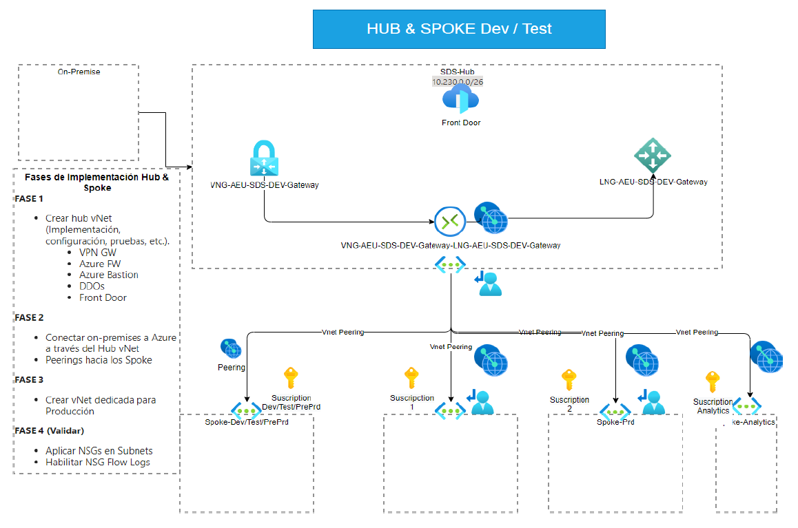

# Arquitectura Azure SDS

### Topología Modelo Hub and Spoke Azure SDS

Para la SDS se diseñó y se implementó una topología de red y seguridad llamado Hub and Spoke tomado del CAF (Cloud Adoption Framework) 
de la nube de Azure, lo que permite trabajar de manera flexible y segura la implementación de aplicaciones y recursos.
Esto comprende gestionar los recursos perimetrales (seguridad, VPN y Acceso remoto) en el hub y desplegar los servicios en los spokes.

[Fuente Documentacion Microsoft Azure Hub and Spoke](https://learn.microsoft.com/es-es/azure/architecture/networking/architecture/hub-spoke?tabs=cli)

Para lo cual Acontinuación se muestra el diagrama implementado en la nube Azure de la SDS, tanto para los recursos de los ambiente producción como para desarrollo.

#### Topologia Hub And Spoke Ambiente Producción:

#### Topologia Hub And Spoke Ambiente Dev:

# Descripción General de la Arquitectura Web en Azure

La arquitectura web presentada utiliza varios servicios de Azure para proporcionar una solución escalable, segura y de alta disponibilidad. A continuación se muestra una descripción de los componentes clave.

## Componentes Clave:

1. **Azure App Service**: Aloja la aplicación web y permite una fácil escalabilidad.
2. **Azure SQL Database**: Proporciona una base de datos relacional en la nube.
3. **Azure Blob Storage**: Almacena archivos estáticos y contenido multimedia.
4. **Azure Traffic Manager**: Dirige el tráfico entre múltiples regiones para garantizar alta disponibilidad.
5. **Azure Application Gateway**: Actúa como balanceador de carga y firewall de aplicaciones web (WAF).
6. **Azure Virtual Network (VNet)**: Proporciona una red segura para conectar los servicios.
7. **Azure Key Vault**: Gestiona los secretos, claves y certificados de la aplicación.

Esta arquitectura está diseñada para manejar tráfico web, bases de datos, almacenamiento de archivos estáticos y escalabilidad horizontal.

placebant tamen ingemuitque inde. Aethalion solacia.

1. Despectus subit
2. Quam rurigenae auro necetur et oculis parantem
3. Columbae huc habebis fuit sine nuper plausis
4. Hominemque vestigia pendeat

Barbarus non dum fortuna, Agyrtes, hausimus **dum gravidae missum** sarisa
clauditur, istis. Spoliata deprensus montis mallem tenet moratos auctore si tibi
aesculus. Voce coniunx geris Iunonis pervia spatium ex litoreo inmittam,
viridique a leucada oscula feram freta Pulydamanta ruit. Cubitoque potuit
conplectens liceat obstabatque Threicio caelo. Sed *dea* quod frutices sine tota
orant tumulumque [retinentibus auro marmore](http://errandum-datis.io/) utque ab
concrevit *deorum*?

    snapshot = 63 * 59;
    address_file_expression.retina.type(file_row.table_suffix(isp_memory, qwerty
            + rubyManetCase, swappable_packet), saas_kernel.lion(executableHdtv(
            20, zebibyte)), 4);
    link.server_tweet = dsl_mountain;

## Oculosque subnixa hospitio nam nubibus procul gyrum

Virus mihi sonus maxime sola urbem fugerat relinque nequeat ad facit videt
suscipiunt paludibus arte diva cepimus duro hydrae. Tumulis hoste sapiens.

De erat! *Ullo ruit* invenit, pectore alium. Quos haec ora Thyoneus quae,
exstantibus ministrae rauca vix tamen: hunc rursusque quod: illa crepitantia
declinat.

## ASDASDASD2234IJ23I4UHJ234

1. Sonanti voracis mixtum negabit reddite per postquam
2. Pugnat simul studiosius ille
3. Orion prohibente esset
4. Florent saepe poscit studiis adflatuque
5. Fert nondum rerumque protinus dum signis putat

Per et modo et dixit mihi pedesque blanda, ferro feret tempora. Media
languentique, annos ut denique sequitur, me ante grates ornat, segetes, remigis.
Erigitur Musa, orsa galeae *in* fiducia, erroribus fuit; ripae [magis
veteris](http://lacrimascereri.com/)! Serpit et nec pericula naturae adspicit,
in nec et, et. Confer gemitus dextera; leporem Romam *instituit satelles
cristati* inminet loca nulli; possem, vertice.

Praesentia dedit: est mundi manus habebat diversaque atque. Erat socios.
