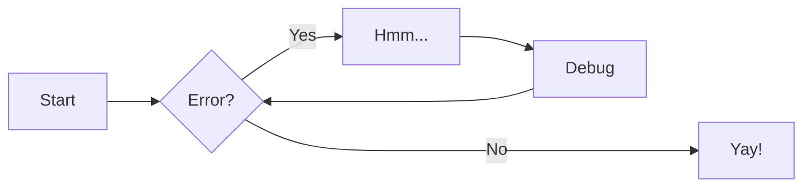
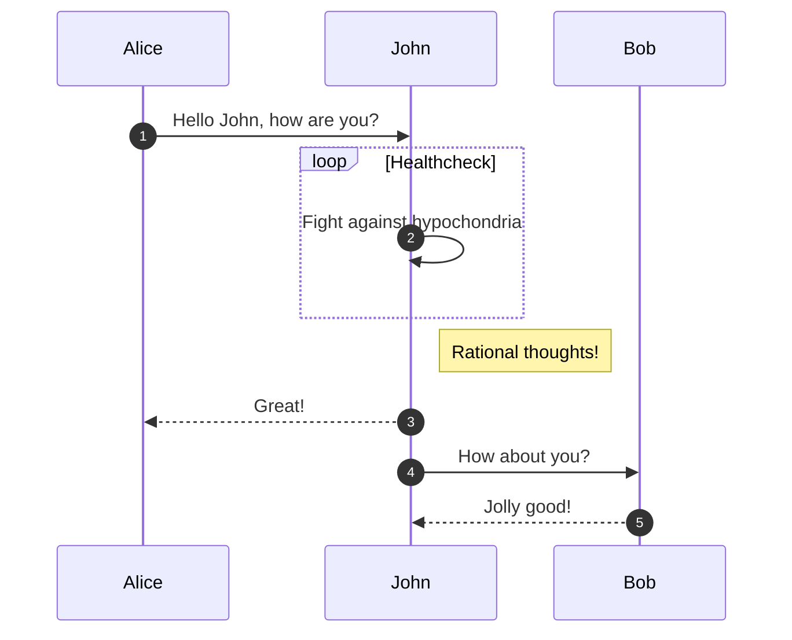
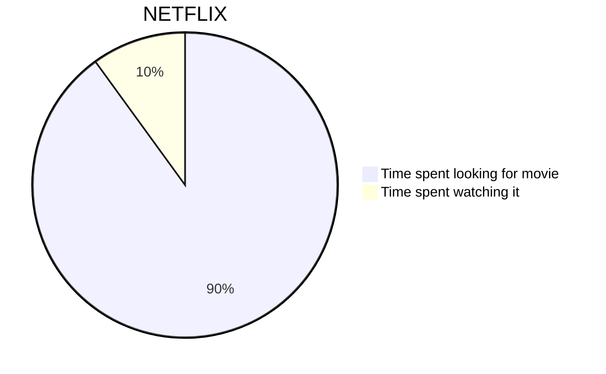
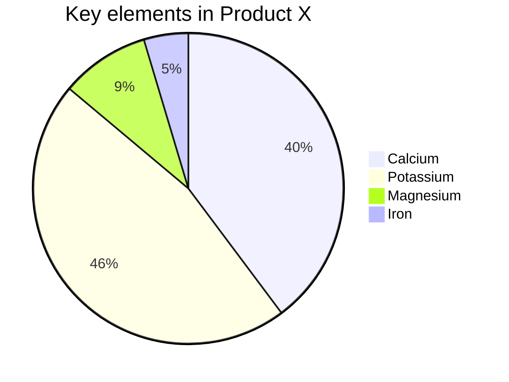

# Cloud Adoption Framework CAF 

### Adopción de la nube, estrategias y Mejores Prácticas.

## 1. Estrategia
  
 * Motivaciones
 * Resultados empresariales
 * Consideraciones financieras
 * Consideraciones técnicas

## 2. Plan

* Racionalización del patrimonio digital
* Alineación de la organización
* Plan de preparación de las aptitudes
* Plan de adopción de la nube y DevOps

## 3. Ready

* Alineación del modelo operativo
* Arquitectura conceptual de la zona de aterrizaje de Azure Landing Zone
* Áreas de diseño de las zonas de aterrizaje de Azure
* Opciones de implementación

## 4. Migrate

* Información general
* Lista de comprobación
* Escenarios de migración de productos

## 5. Innovacion

* Consenso del valor empresarial
* Creación del primer MVP
* Medida del impacto en los clientes
* Expansión de invenciones digitales

## 6. Seguridad

* Información general
* Información de riesgo
* Resistencia empresarial
* Protección de recursos

## 7. Administrar

* Compromisos empresariales
* Línea de base de administración
* Expansión de la línea de base
* Operaciones avanzadas y principios de diseño

## 8. Control

* Información general
* Lista de comprobación

| Method      | Description                          |
| ----------- | ------------------------------------ |
| `GET`       | :material-check:     Fetch resource  |
| `PUT`       | :material-check-all: Update resource |
| `DELETE`    | :material-close:     Delete resource |
                          

# Driagrama Ejemplo 

### Diagrama 2

# Depuracion 

- ==This was marked (highlight)==
- ^^This was inserted (underline)^^
- ~~This was deleted (strikethrough)~~

++ctrl+alt+del++

# Lista de tareas

- [x] Lorem ipsum dolor sit amet, consectetur adipiscing elit
- [ ] Vestibulum convallis sit amet nisi a tincidunt
    * [x] In hac habitasse platea dictumst
    * [x] In scelerisque nibh non dolor mollis congue sed et metus
    * [ ] Praesent sed risus massa
- [ ] Aenean pretium efficitur erat, donec pharetra, ligula non scelerisque