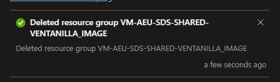

## Arquitectura y Servicios de Networking

### 1. Introducción

**Objetivo:** Explicar el propósito de la arquitectura de red en la suscripción.

**Resumen de la suscripción:** Breve descripción de la suscripción en la que está implementada la red.

**Componentes principales:** Mención de los principales componentes de red utilizados en la suscripción (por ejemplo, redes virtuales, firewalls, etc.).

### 2. Arquitectura General

**Diagrama de la arquitectura de red:**
Incluir un diagrama que represente gráficamente la estructura de la red en Azure.

**Topología de red:** 
Explicar la estructura de subredes, conexiones y grupos de seguridad que forman la arquitectura.

**Modelos de conectividad:** 
Describir el enfoque adoptado (por ejemplo, Hub-and-Spoke, arquitectura de malla, etc.).

**Regiones y Zonas de Disponibilidad:** 
Describir cómo se distribuyen los recursos de red a través de diferentes regiones y zonas de disponibilidad para asegurar alta disponibilidad y recuperación ante desastres.

### 3. Virtual Network (VNet)

**Descripción de las VNet:**
Describir la configuración de las Redes Virtuales (VNet).

**Segmentación de subredes:** 
Definir cómo están organizadas las subredes (subnets) dentro de la VNet, sus rangos de IP, y su propósito.

**Reglas de direccionamiento:**
Explicar las políticas de direccionamiento IP y cómo se gestiona el enrutamiento interno y externo.

## Cuadro de Vnets y sus segmentos para ambiente Shared

| **Suscripción** | **VNet Nombre** | **Subred Nombre** | **Rango de IP**     | **Propósito**                    | **Emparejamiento**               | **Dispositivos Conectados**          |
|-----------------|-----------------|------------------|---------------------|----------------------------------|----------------------------------|--------------------------------------|
| SDS Shared      | VNet-Shared      | Subred-App1      | 10.0.0.0/24         | Aplicaciones compartidas         | Emparejada con VNet-DevTest      | 2 Máquinas Virtuales (App1-VM1, App1-VM2) |
| SDS Dev Test    | VNet-DevTest     | Subred-Dev       | 10.1.0.0/24         | Desarrollo y pruebas             | Emparejada con VNet-Shared       | 3 Máquinas Virtuales (Dev-VM1, Dev-VM2, Dev-VM3) |
| SDS Salud       | VNet-Salud       | Subred-Web       | 192.168.0.0/24      | Frontend Web para SDS Salud      | Emparejada con VNet-DB           | 1 Servidor Web (Web-VM1)             |
|                 |                 | Subred-DB        | 192.168.1.0/24      | Base de datos para SDS Salud     | Emparejada con VNet-Salud        | 1 Servidor SQL (DB-VM1)              |
| SDS SGDEA       | VNet-SGDEA       | Subred-Admin     | 172.16.0.0/24       | Administración de SGDA Capital   | No emparejada                    | 1 Bastion Host, 2 Máquinas Virtuales (Admin-VM1, Admin-VM2) |

## Cuadro de Vnets y sus segmentos para ambiente DevTest

### 4. Conectividad entre Redes

**VPN Gateway / ExpressRoute:** 
Explicar si se utiliza una VPN Gateway o ExpressRoute para conectividad híbrida con redes locales.

**Conexiones entre VNets (VNet Peering):**
Describir las conexiones entre diferentes VNets, tanto dentro de la misma región como entre regiones.

**Bastion Host:** Explicar si se utiliza un Bastion Host para acceder de manera segura a las máquinas virtuales.

## Peerings

La conectividad entre diferentes redes dentro de la suscripción se gestiona principalmente a través de conexiones **VNet Peering** y un **ExpressRoute** para la integración con redes on-premises. La siguiente tabla resume las configuraciones de conectividad:

| Tipo de Conexión       | Descripción                                        |
|------------------------|----------------------------------------------------|
| **VNet Peering**        | Se ha establecido una conexión VNet Peering entre la VNet principal y las VNets en las regiones secundarias para asegurar una comunicación rápida y segura entre ellas sin necesidad de un gateway adicional. |
| **ExpressRoute**        | Para asegurar una conexión de alta velocidad y baja latencia con las redes on-premises, se ha configurado un circuito ExpressRoute que proporciona una conexión privada y segura. |
| **Bastion Host**        | Un Azure Bastion Host se utiliza para facilitar el acceso seguro a las máquinas virtuales, eliminando la necesidad de exponer puertos SSH o RDP al internet. |

### 5. Seguridad de Red

**Network Security Groups (NSG):** 
Describir las reglas de tráfico de red configuradas en los NSG (grupos de seguridad de red).

**Azure Firewall:**
Detallar si se utiliza Azure Firewall para controlar el tráfico de red entrante y saliente, y cómo está configurado.

**Azure DDoS Protection:**
Explicar las protecciones implementadas para mitigar ataques DDoS.

**Application Gateway / WAF (Web Application Firewall):**
Describir la implementación de un Application Gateway o un Web Application Firewall para proteger aplicaciones.

### 6. Balanceo de Carga y Redundancia

**Azure Load Balancer:**
Explicar si se utiliza un Load Balancer para distribuir el tráfico entre máquinas virtuales.

**Traffic Manager:**
Detallar si Traffic Manager se usa para distribuir tráfico entre diferentes regiones o zonas geográficas.

**Disponibilidad y alta disponibilidad:** 
Cómo se asegura la disponibilidad de los servicios y aplicaciones a través de la arquitectura de red.

### 7. Azure DNS y Resolución de Nombres

**Azure DNS Zone (Public):** 
Explicar cómo está configurado el DNS para gestionar la resolución de nombres dentro y fuera de la red.

**Azure Private DNS Zones:** 
Describir si se utilizan zonas DNS privadas para resolver nombres dentro de la VNet.

### 8. Monitoreo y Mantenimiento de la Red

**Network Watcher:**
Explicar si se utiliza Network Watcher para supervisar la red, verificar la conectividad y diagnosticar problemas.

**Logs y Auditoría:**
Describir cómo se registran los eventos de la red, los logs y los mecanismos de auditoría implementados.

**Alertas y Monitoreo:** 
Detallar cómo se configuran las alertas para incidentes o problemas de conectividad.

### 9. Escalabilidad y Mejores Prácticas

**Escalabilidad:** 
Describir las estrategias adoptadas para escalar la red según las necesidades de la suscripción.

**Mejores Prácticas:** 
Incluir recomendaciones y mejores prácticas para la configuración de redes en Azure, basadas en las guías de Microsoft.
Cost Optimization

1. No cost and usage monitoring
2. Unclear on underused or orphaned resources
3. Lack of structure billing management
4. Budget reductions due to lack of support for cloud adoption by LT/board

Acontiunacion puede visualizar el framework [Well architected framework](https://aka.ms/wellarchitected/framework)

## Deleted Resources Sept 2024

[Puede descargar el archivo en el siguiente enlace:](archivos/CAF/Prueba1.pdf)

## Tabla comparativa Resources A-B

> **Nota**: Asegúrate de seguir los pasos en el orden correcto para evitar errores.

| Producto     | Precio  |
|--------------|---------|
| Producto A   | $10.00  |
| Producto B   | $20.00  |

# Servicios Involucrados en la Arquitectura

## 1. Azure App Service
El **App Service** en Azure proporciona un entorno de alojamiento completamente administrado para aplicaciones web, APIs y backends móviles. Es compatible con .NET, Java, Python, y más.

**Características**:
- Autoescalado para manejar la demanda.
- Integración con DevOps para implementaciones continuas.
- Certificados SSL/TLS gratuitos.

## 2. Azure SQL Database
Es una base de datos como servicio completamente administrada que soporta hasta 99.99% de disponibilidad. Incluye características como recuperación ante desastres y respaldo automático.

## 3. Azure Blob Storage
Permite el almacenamiento de archivos no estructurados como imágenes, videos y archivos de texto en la nube, ofreciendo opciones de acceso mediante HTTP/HTTPS.

...

Cada servicio está configurado para cumplir con los requisitos de disponibilidad, escalabilidad y seguridad de la aplicación.

## Fondo Financiero Distrital de Salud main Azure resources

- Azure App Service
- SQL Managed Instance
- API Management
- Storage
- Virtual Machines
- SQL Database
- Microsoft Defender for Cloud
- Azure Front Door Service
- Azure Firewall
- Power BI Embedded
- Application Gateway
- VPN Gateway
- Azure Database for MySQL
- Azure Bastion
- Bandwidth
- Azure DevOps
- Redis Cache
- Azure Firewall Manager
- Azure Cognitive Search
- Azure Database for PostgreSQL
- Container Registry
- Virtual Network
- Backup
- Log Analytics
- Azure Data Factory v2
- Load Balancer
- Container Instances
- Azure Synapse Analytics
- Azure Load Testing
- Cognitive Services
- Service Bus
- Azure DNS
- Automation
- Logic Apps
- Network Watcher
- Azure Monitor
- Virtual Machines Licenses
- Key Vault
- Content Delivery Network
- Azure Active Directory for External Identities
- Event Grid
- Functions

Este es un ejemplo de código en línea: `print('Hola Mundo')`.
