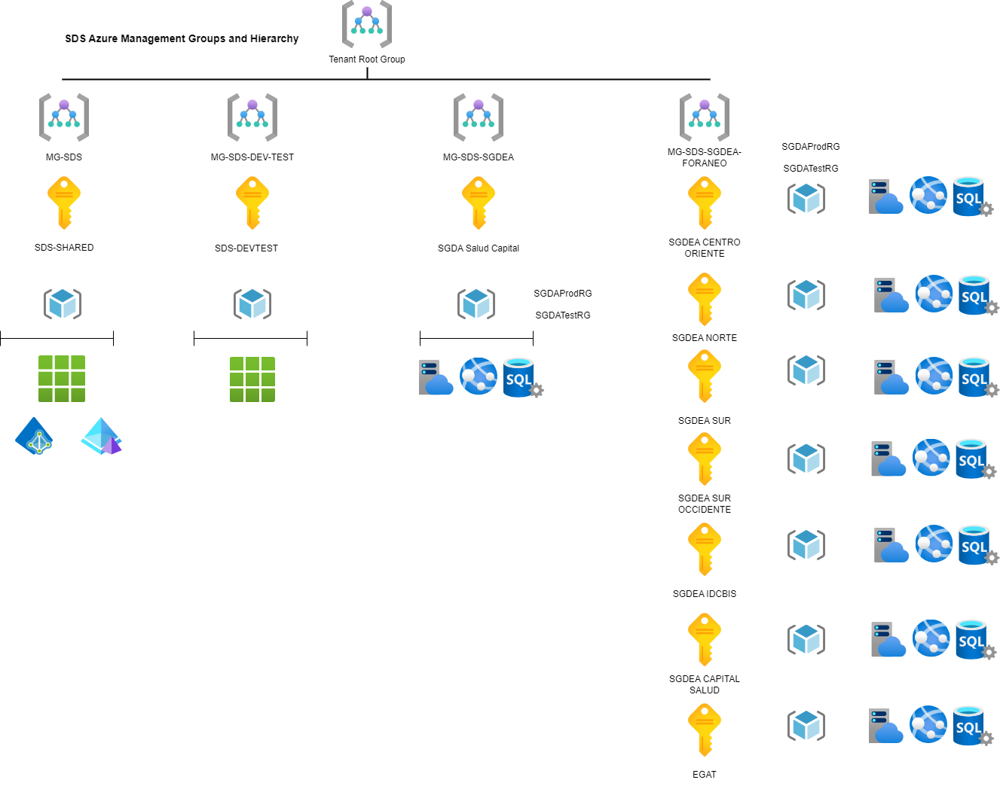
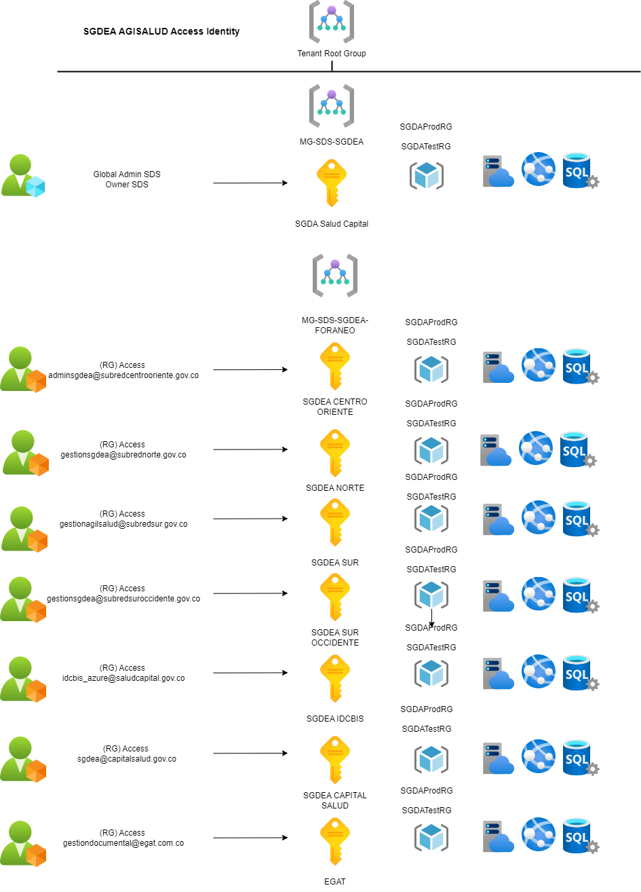

Arquitectura Azure SDS
=======================================

## Management Group, Tenant Root Group y Suscripciones.

En Azure, el Tenant Root Group es el grupo raíz que organiza y estructura todos los recursos y suscripciones dentro de un entorno Azure AD (Active Directory). Es el nivel más alto de la jerarquía de Management Groups, permitiendo aplicar políticas y controles a todas las suscripciones en un tenant.

Las suscripciones de Azure permiten administrar recursos como máquinas virtuales, bases de datos y redes, y son unidades lógicas que separan los servicios y recursos. Cada suscripción está vinculada a un directorio de Azure AD y puede estar organizada dentro de uno o más Management Groups bajo el Tenant Root Group.

El portal de Azure para la SDS actualmente cuenta con el siguiente Management Group y suscripciones:

## Tenant Root Group y Suscripciones Principales

El presente grupo de administración (Management Group) incluye las suscripciones principales SDS-SHARED y SDS-DEV-TEST, las cuales alojan los principales recursos de producción y pruebas desplegados para el funcionamiento de la infraestructura y los servicios hospedados en la nube de Azure para SDS.

## Management Group y Suscripciones Externas o Secundarias

Se ha configurado un grupo de administración (Management Group) para la gestión de las suscripciones de SGDA. Estas suscripciones contienen los recursos desplegados para el funcionamiento de la aplicación Agilsalud (Gestor Documental), utilizada por las entidades: SDS, IDCBIS, EGAT, Subred Norte, Subred Sur, Subred Sur Occidente, Subred Centro Oriente y Capital Salud. Actualmente, estos servicios son costeados a través del billing de la SDS.

!!! note "Nota"

    En el siguiente cuadro se muestra la relación entre las suscripciones principales y secundarias, así como los grupos de administración correspondientes con su respectiva descripción.

| **Tipo de Suscripción**   | **Management Group**         | **Nombre de Suscripción**          | **Descripción**                           |
|--------------------------|-----------------------------|------------------------------------|------------------------------------------|
| **Suscripciones Principales** | Tenant Root Group           | SDS Shared                         | Suscripción principal                    |
|                          | MG-SDS-DEV-TEST             | SDS Dev Test                       | Suscripción secundaria, ambiente de pruebas |
|                          | MG-SDS-SGDEA                | SDS Salud Capital                  | Suscripción Agilsalud SDS                |
|                          |                             |                                    |                                          |
| **Suscripciones Secundarias** | MG-SDS-SGDEA-FORANEO     | SDS Sur Occidente                  | Subscripción Agilsalud Subred Sur Occidente |
|                          |                             | SGDA Capital Salud                 | Subscripción Agilsalud Capital Salud      |
|                          |                             | SGDA Centro Oriente                | Subscripción Agilsalud Subred Centro Oriente |
|                          |                             | SGDA EGAT                          | Subscripción Agilsalud EGAT                 |
|                          |                             | SGDA IDCBIS                        | Subscripción Agilsalud IDCBIS              |
|                          |                             | SGDA Subred Norte                  | Subscripción Agilsalud Subred Norte     |
|                          |                             | SGDA Sur                           | Subscripción Agilsalud Subred Sur    |
