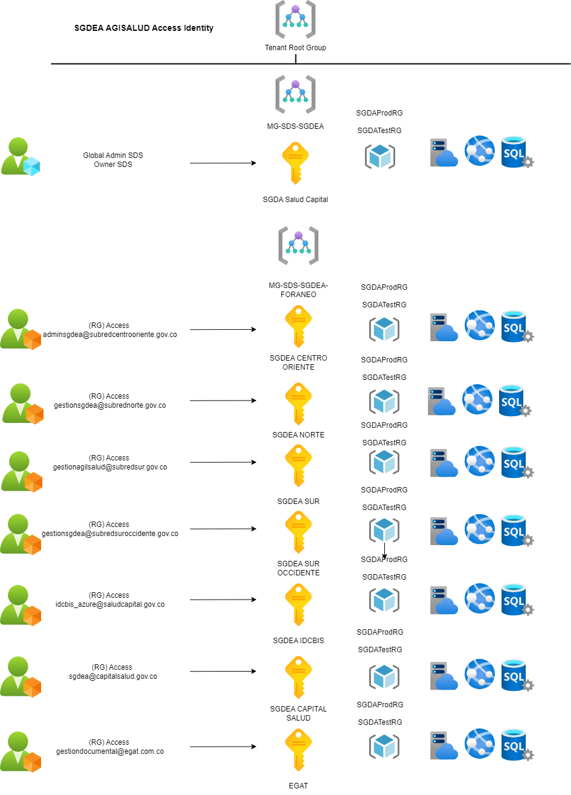

# Arquitectura Azure SDS

## Management Group, Tenant Root Group y Suscripciones.

En Azure, el Tenant Root Group es el grupo raíz que organiza y estructura todos los recursos y suscripciones dentro de un entorno Azure AD (Active Directory). Es el nivel más alto de la jerarquía de Management Groups, permitiendo aplicar políticas y controles a todas las suscripciones en un tenant.

Las suscripciones de Azure permiten administrar recursos como máquinas virtuales, bases de datos y redes, y son unidades lógicas que separan los servicios y recursos. Cada suscripción está vinculada a un directorio de Azure AD y puede estar organizada dentro de uno o más Management Groups bajo el Tenant Root Group.

## Tenant Root Group y Suscripciones Principales

## Management Group y Suscripciones Secundarias

Se tienen configurado un management group para la administración de las suscripciones de SGDA, estas contienen los recursos desplegados para el funcionamiento de la aplicación de Agilsalud para las entidades: SDS, IDCBIS, EGAT, Subred Norte, Subred Sur, Subred Sur Occidente, Subred Centro Oriente y Capital Salud.

## Management Group, Tenant Root Group y Suscripciones.